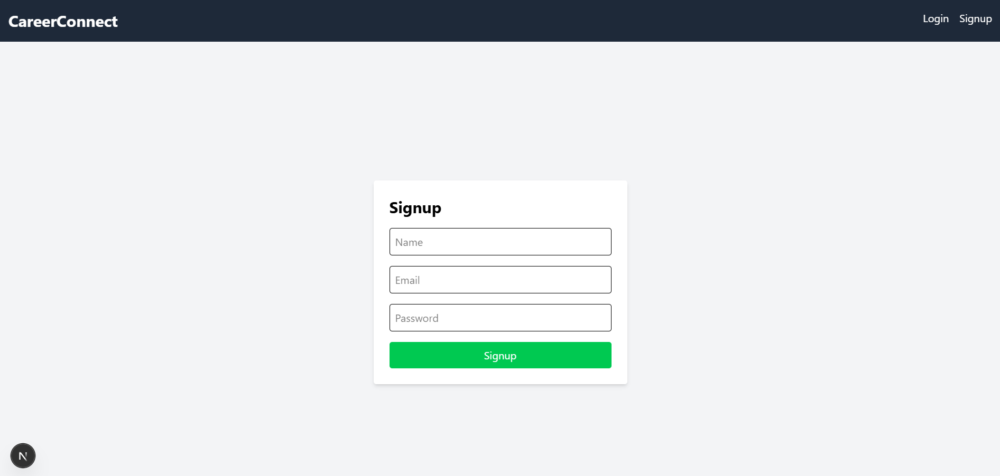
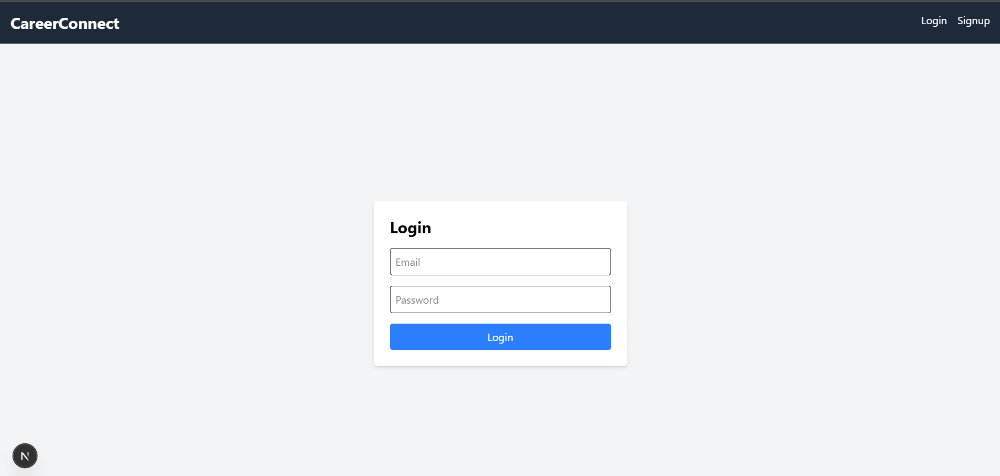
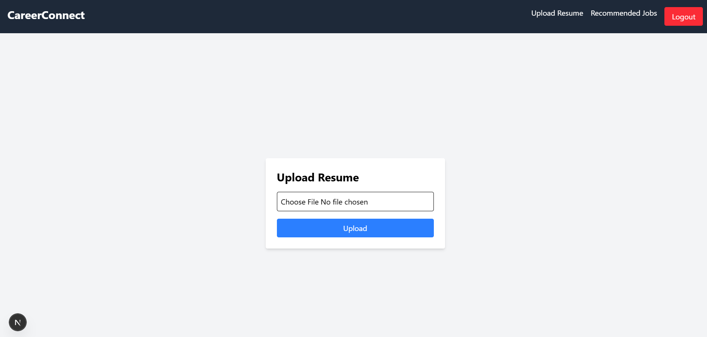
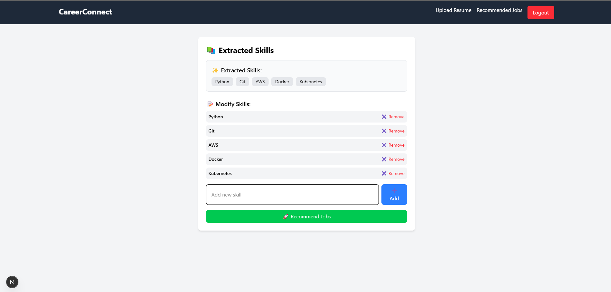
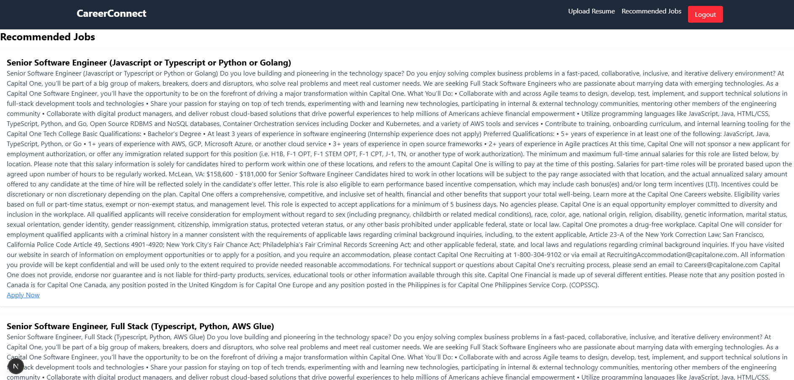

🚀 CareerConnect – Job Recommendation System

🎯 Project Overview
CareerConnect is a Job Recommendation System built using the MERN stack and deployed on Google Cloud Platform (GCP). It extracts skills from user resumes using an ML-based approach and recommends job listings based on similarity scoring.

📚 Features
✅ Sign Up & Log In – JWT-based authentication
✅ Resume Upload – PDF/DOCX stored in GCP Cloud Storage
✅ Skill Extraction – NLP model to extract relevant skills
✅ Job Matching – Matches extracted skills with job listings
✅ Job Recommendation API – Returns relevant jobs
✅ Efficient Searching – MongoDB indexing for quick lookups
✅ Backend Deployment on GCP VM
✅ Minimal Frontend (Next.js) – Upload resumes and view job recommendations

⚙️ Backend Setup

📚 1. Clone the Repository
```bash
git clone https://github.com/07Abhinav/CareerConnect.git
cd CareerConnect/backend
```
📚 2. Configure Environment Variables
Create a .env file in the backend directory:
```bash
MONGO_URI=mongodb+srv://<username>:<password>@cluster0.mongodb.net/CareerConnect
JWT_SECRET=your_jwt_secret
GCP_BUCKET_NAME=your_bucket_name
GCP_PROJECT_ID=your_project_id
GCP_KEY_JSON=your_gcp_key_json
JSEARCH_API_KEY=your jsearch key
```
📚 3. Install Dependencies
```bash
npm install
```

📚 4. Run Backend Locally
```bash
node server.js
# OR use nodemon for auto-restart
nodemon server.js
```
✅ Backend running at: http://localhost:5000

Now to check the api endpoints

1. Signup
```bash
POST API = http://35.193.73.53:5000/api/auth/signup
```
In body select json

```bash
{
    "email": "your email",
    "password": "your password"
}
```
2. Login
```bash
POST API = http://35.193.73.53:5000/api/auth/login
```
In body select json

```bash
{
    "email": "your email",
    "password": "your password"
}
```
It will give the response

```bash
{
    "token": "Unique token"
}
```
Copy the token

3. Upload the resume
```bash
POST API = http://35.193.73.53:5000/api/resume/upload
```
Go to AUTHORIZATION on postman
```bash
Select Auth Type - Bearer Token
Token = "paste the token from login'
```
Go to Body
```bash
Select form-data
Key = resume
type = file
Value = your resume
```
It will give response of your skills
```bash
Example
{
    "skills": [
        "JavaScript",
        "React",
        "Node.js",
        "Express.js",
        "MongoDB",
        "Python",
        "SQL",
        "Git",
        "CSS",
        "AWS",
        "Docker",
        "Kubernetes",
        "Java",
        "C++"
    ]
}
```

4. Get the recomended jobs
```bash
POST API = http://35.193.73.53:5000/api/jobs/recommend
```

Go to AUTHORIZATION on postman
```bash
Select Auth Type - Bearer Token
Token = "paste the token from login'
```
Go to Body select json
```bash
Paste your skill extracted from resume
Example
{
    "skills": [
        "JavaScript",
        "React",
        "Node.js",
        "Express.js",
        "MongoDB",
        "Python",
        "SQL",
        "Git",
        "CSS",
        "AWS",
        "Docker",
        "Kubernetes",
        "Java",
        "C++"
    ]
}
```
It will give the response of recommended job according to your skills

Frontend Setup

```bash
cd careerconnect-frontend
npm i
```

run the frontend
```bash
npm run dev
```

Results

Sign up


Login


upload-resume


recommed


recommended-jobs


